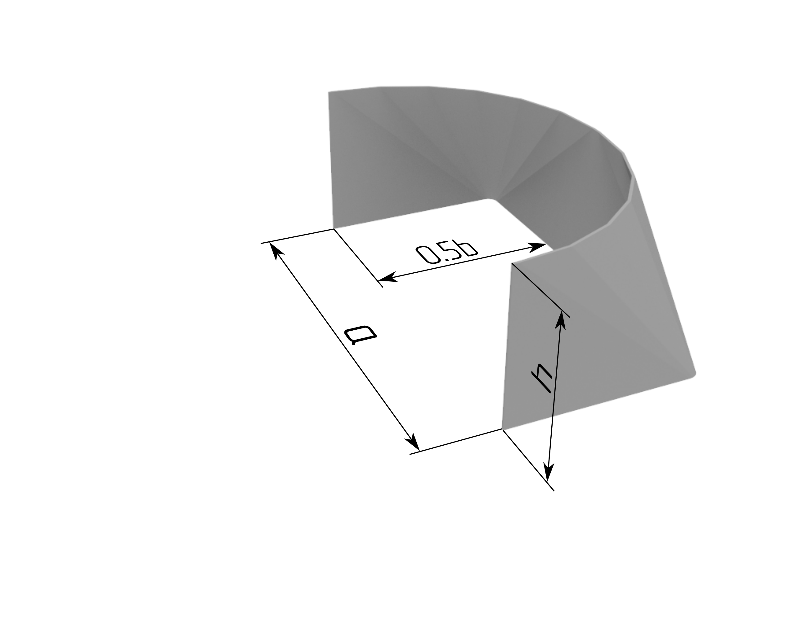

This script creates a DXF file of a flat pattern of a sheet metal part. 
The user (engineer) enters the parameters (dimensions, metal thickness, number of bends, etc.) of the part in the input block 

'''
# input block
a = 378   # internal length
b = 278   # inner width
d = 300   # inner diameter
h = 250   # height
s = 3     # metal sheet thickness
n = 5     # number of bends per 1 angle (per 90 degree sector)
ec = 0    # eccentricity on the 'a' side  (x coordinate)
k = 0.4   # coefficient of displacement of the central layer
'''
and runs the script. 

The DXF file will appear in the same directory.

